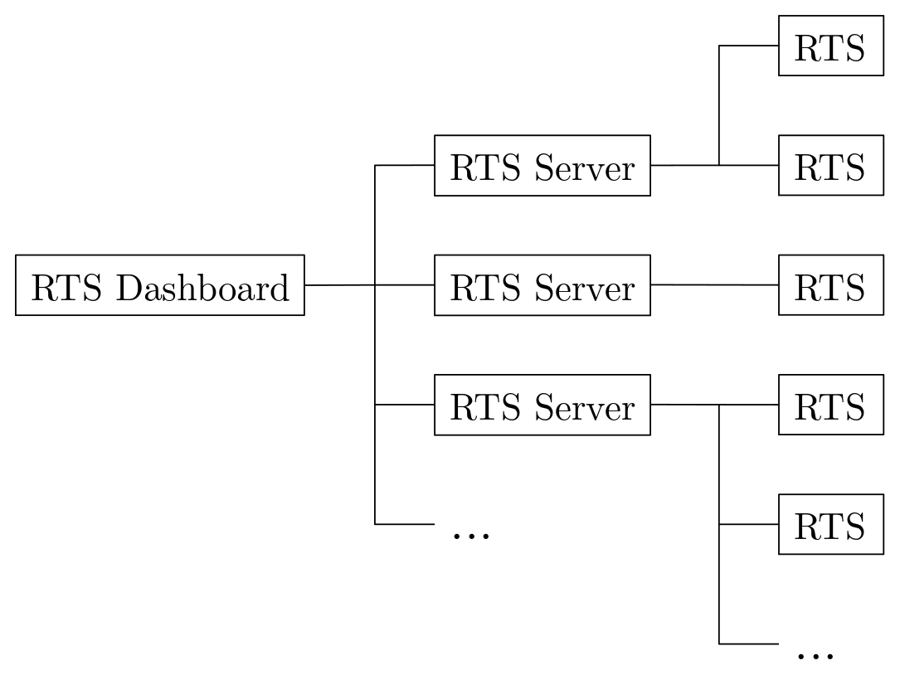

<div align="center">
    <h1>Robotic Total Station Dashboard</h1>
    <a href="https://github.com/gereon-t/rts-dashboard/releases"></a>
    <a href="https://www.python.org/downloads/"></a>
    <a href="https://github.com/gereon-t/rts-dashboard/blob/main/LICENSE"></a>
    <a href="https://github.com/psf/black"></a>

#### With RTS Dashboard you can easily control multiple RTS connected to logging devices within the same network.

<p align="center">
  
</p>

</div>

Device icon from [Hopstarter](https://www.flaticon.com/free-icons/raspberry-pi). RTS icon from [Freepik](https://www.flaticon.com/free-icons/topography).

# Installation

```bash
docker run -p 8050:8050 gtombrink/rts-dashboard
```

or using the docker-compose file:

```yaml
version: "3.8"
services:
  rts-dashboard:
    image: gtombrink/rts-dashboard
    ports:
      - 8050:8050
    restart: unless-stopped
```

```bash
docker-compose up -d
```

You can now access the dashboard at http://localhost:8050.

# Architecture



A single instance of the RTS Dashboard has the capability to oversee and manage multiple logging devices running the RTS Server, which will soon be available at https://github.com/gereon-t/rts-server. The RTS Server functions as an intermediary, receiving requests through a REST API and forwarding them to the associated RTS instances using serial communication. Additionally, the RTS Server collects data from the connected RTS devices and sends it to the RTS Dashboard if requested. The tasks of each connected RTS are managed by separate rq workers that read jobs from a Redis queue.
